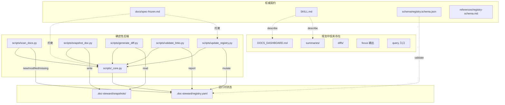

# doc-steward 当前实现全景

> **本文档是「当前实现取证」，不是未来设计。**
> 所有判断基于仓库实际证据，遵循「可运行代码 > 机器可读 Schema > 测试 > 冻结契约 > SKILL.md > 设计文档 > 文件名/注释」的优先级。

---

## 0. 文档信息

| 项目            | 值                                                                                        |
| --------------- | ----------------------------------------------------------------------------------------- |
| 审计日期        | 2026-07-29                                                                                |
| 仓库 commit SHA | `7c3b305dffc4c302f16b49701b6b41aeb614423d`                                                |
| 工作区状态      | clean（仅 2 个 untracked 文件：`.workbuddy/memory/2026-07-28.md` 和 `doc-steward/` 目录） |
| Skill 路径      | `C:\100-Working\105-Working-improvement\github_lib\zhangjl-skills\doc-steward`            |
| 探索范围        | `doc-steward/` 下全部 16 个文件（含 `__pycache__`）                                       |
| 执行过的测试    | 15 个端到端 smoke test（临时目录隔离，未修改正式仓库）                                    |
| 测试结果        | **15/15 通过**                                                                            |
| 探索方法        | 全文件读取 + 脚本隔离运行 + 临时夹具端到端追踪                                            |

---

## 1. 执行摘要

### 当前实现成熟度

doc-steward 处于 **MVP 后端刚完成、前端/LLM 层完全缺失** 的阶段。

- **已完成**：5 个确定性 Python 脚本 + 1 个共享核心模块，覆盖 registry 扫描、更新、快照、diff、校验。
- **未开始**：Dashboard 生成、L0/L1 摘要、注意力分级输出、Front Matter drift 检测、query/focus 自然语言入口。
- **文档丰富**：SKILL.md / spec-frozen.md / design.md / registry-schema.md / JSON Schema / 示例 registry / evals 均已就绪。

### 已形成的真实闭环

**仅有一个**：`register → promote → supersede → archive → delete` 的状态机闭环，全部在 `update_registry.py` 内，有 Tier2 审批校验、原子写入（write-then-rename）、冲突检测。

### 最主要的三个系统性风险

1. **P0 — 内容修改无守卫**：脚本不读取 `FROZEN` 状态，不拦截对 `FROZEN` 文档的内容修改。I5 仅停留在文档。
2. **P0 — 派生产物 provenance 缺失**：`generate_diff.py` 输出不含 provenance 行；Dashboard 生成器不存在。spec §2.4/§3.4 未落地。
3. **P1 — 无原子事务**：`supersede` 涉及多文档写入，无 compare-and-swap、无回滚、无幂等键。中途失败会留下半完成状态。

### 是否适合进入 Schema/脚本继续实现

**适合**。Schema 和脚本基础扎实，spec 边界清晰。但需先解决：

- 内容修改的 FROZEN 守卫
- 派生产物的 provenance 强制
- supersede 的原子性保证

### 是否适合在真实项目中使用

**不适合直接用于生产治理**。当前状态适合：

- 作为 LLM 辅助的**只读建议层**（scan + validate + diff）
- 作为**手动状态机**（用户在终端执行 `update_registry.py promote ...`）

不适合：

- 自动化流水线
- 多 Agent 协作
- 需要审批审计的场景

### 推荐给第三方重点评审的议题

1. 产品定位是否过重——6 种状态 + Tier2 批准 + 原子替代，对 AI 文档管理是否过度设计？
2. 状态机是否闭合——`stale` 既是派生标志又承载"内容漂移"语义，是否应拆分？
3. 批准模型是否可靠——`decision.by=user` 在 CLI 字符串层面，如何防止伪造？
4. registry 数据模型是否足够——缺少 `revision_history[]`、`approval_chain[]`、`operation_id` 审计字段。
5. 自动化与人工决策边界——脚本何时应由 Agent 调用，何时必须用户显式执行？

---

## 2. 项目结构与组件地图

### 实际文件树

```
doc-steward/
├── SKILL.md                                     # 操作指南（主文件）
├── README.md                                    # 项目说明
├── docs/
│   ├── spec-frozen.md                           # 冻结设计规格（权威契约）
│   └── design.md                                # 设计背景与定位
├── references/
│   └── registry-schema.md                       # registry.yaml 字段契约
├── schema/
│   └── registry.schema.json                     # 机器可读 JSON Schema
├── examples/
│   └── registry.example.yaml                    # 覆盖各状态的示例
├── evals/
│   └── evals.json                               # 行为评测用例（3 个）
└── scripts/
    ├── __init__.py                              # 包标识
    ├── _core.py                                 # 共享 helpers（244 行）
    ├── scan_docs.py                             # 扫描 document_roots
    ├── update_registry.py                       # 维护 registry（345 行）
    ├── snapshot_doc.py                          # 保存快照
    ├── generate_diff.py                         # 生成 revision 间 diff
    └── validate_links.py                        # 校验依赖与冲突
```

### 组件关系图



### 文件分类

| 类别       | 文件                                                                                           | 真实参与运行 | 说明                       |
| ---------- | ---------------------------------------------------------------------------------------------- | :----------: | -------------------------- |
| Skill 定义 | SKILL.md, README.md                                                                            |    仅文档    | 操作指南，不执行           |
| 权威契约   | docs/spec-frozen.md                                                                            |    仅文档    | 冻结规格，供脚本遵循       |
| 设计背景   | docs/design.md                                                                                 |    仅文档    | 提案性，部分已过时         |
| Schema     | schema/registry.schema.json                                                                    |    未使用    | 机器可读，但脚本未加载校验 |
| 字段契约   | references/registry-schema.md                                                                  |    仅文档    | 映射 spec 条款             |
| 示例       | examples/registry.example.yaml                                                                 |    仅示例    | 覆盖六状态 + 冲突          |
| 评测       | evals/evals.json                                                                               |    未运行    | 3 个 eval，无 runner       |
| 核心模块   | scripts/\_core.py                                                                              |      ✅      | 所有脚本依赖               |
| 脚本       | scripts/scan_docs.py, update_registry.py, snapshot_doc.py, generate_diff.py, validate_links.py |      ✅      | 可独立运行                 |

### 根目录确认

| 根目录                  | 实际路径               | 说明                                      |
| ----------------------- | ---------------------- | ----------------------------------------- |
| SKILL_ROOT              | `.../doc-steward/`     | Skill 自身文件                            |
| PROJECT_ROOT            | 运行时由 `--root` 指定 | 用户项目，含 `.doc-steward/registry.yaml` |
| RUNTIME_STATE_ROOT      | `.doc-steward/`        | registry + snapshots                      |
| GENERATED_ARTIFACT_ROOT | **不存在**             | Dashboard/summaries/diffs 未生成          |

**关键发现**：Skill 未强制区分 SKILL_ROOT 与 PROJECT_ROOT。`find_project_root()` 向上查找 `.doc-steward/registry.yaml`，若 Skill 安装目录与项目目录不同，可能误将 Skill 安装目录识别为项目根。

---

## 3. 规范层级与权威关系

### 规范层级表

| 文件                             | 声称的权威级别             | 实际覆盖范围                 | 与其他文件冲突                                                                 |
| -------------------------------- | -------------------------- | ---------------------------- | ------------------------------------------------------------------------------ |
| `docs/spec-frozen.md`            | **最高**（"权威契约"）     | 生命周期、事实源、输出格式   | 与 SKILL.md 在 Tier2 列表上略有差异（spec 多 `ARCHIVED→SUPERSEDED`）           |
| `SKILL.md`                       | 操作指南（"以 spec 为准"） | 触发边界、七种操作、禁止事项 | 声称"脚本就绪前按 spec 手动执行"，但脚本已就绪                                 |
| `schema/registry.schema.json`    | 机器可读权威               | registry 结构校验            | **未被任何脚本加载**——仅作为文档存在                                           |
| `references/registry-schema.md`  | 字段契约                   | 字段表 + 条件约束            | 与 JSON Schema 一致，但 `needs_attention` 在 schema 中不存在（符合 spec 声明） |
| `docs/design.md`                 | 设计背景                   | 概念模型、Front Matter 示例  | 包含 `owner`、`related_docs`、`summary_ref` 等**未进入 spec/schema 的字段**    |
| `examples/registry.example.yaml` | 示例                       | 六状态 + 冲突示意            | 与 spec 一致                                                                   |
| `evals/evals.json`               | 评测用例                   | 3 个场景                     | 无 runner，无法自动执行                                                        |

### 冲突矩阵

| 冲突点                 | 来源 A                                            | 来源 B                                      | 严重性                       |
| ---------------------- | ------------------------------------------------- | ------------------------------------------- | ---------------------------- |
| Tier2 列表             | spec §1.3 含 `ARCHIVED→SUPERSEDED`                | SKILL.md 核心契约速查表未列出               | 低（SKILL 说"以 spec 为准"） |
| Front Matter 字段      | design.md 含 `owner`/`related_docs`/`summary_ref` | spec §2.1 声明 FM 非权威，schema 无这些字段 | 低（design.md 是提案性）     |
| `needs_attention` 存储 | registry-schema.md 说"不持久化"                   | JSON Schema 无此字段                        | 一致（都不存储）             |
| 脚本就绪状态           | SKILL.md §脚本入口说"规划中"                      | 脚本已存在且测试通过                        | **文档过时**                 |

---

## 4. 运行时架构

### 真实运行时流程

```
用户自然语言请求
  ↓
[缺失：Skill 意图识别]
  ↓
LLM 判断操作类型（register/sync/focus/promote/supersede/archive/query）
  ↓
LLM 调用对应脚本（或手工模拟）
  ↓
脚本执行：
  ├── scan_docs.py      → 输出 JSON 报告（new/modified/missing）
  ├── update_registry.py → 修改 registry.yaml（原子写入）
  ├── snapshot_doc.py   → 保存快照到 .doc-steward/snapshots/
  ├── generate_diff.py  → 输出 L2 diff 文本
  └── validate_links.py → 输出校验报告
  ↓
[缺失：Dashboard 生成]
[缺失：L0/L1 摘要生成]
[缺失：注意力分级算法]
  ↓
LLM 根据脚本输出 + spec §3.3 格式，内联输出结果
```

### 不存在部分（标明状态）

| 组件                     | 状态          | 说明                                               |
| ------------------------ | ------------- | -------------------------------------------------- |
| DOCS_DASHBOARD.md 生成器 | **NOT_FOUND** | spec §3.4 定义，无实现                             |
| summaries/ 生成器        | **NOT_FOUND** | L1 执行摘要，无实现                                |
| diffs/ 聚合器            | **NOT_FOUND** | L2 变化摘要聚合，无实现                            |
| focus 输出               | **NOT_FOUND** | 最小阅读集，无实现                                 |
| query 入口               | **NOT_FOUND** | 自然语言查询，无实现                               |
| Front Matter drift 检测  | **NOT_FOUND** | spec §2.6 要求，无实现                             |
| Schema 校验加载          | **NOT_FOUND** | JSON Schema 存在，但脚本未 `jsonschema.validate()` |
| 自动触发机制             | **NOT_FOUND** | spec 说 `invocation: manual`                       |

---

## 5. 数据模型

### 5.1 registry 顶层结构

```yaml
version: "1.0" # registry 格式版本
config:
  document_roots: [docs] # 扫描根目录
  exclude: [] # 排除模式（glob）
documents: # 文档条目数组
  - <document>
```

**校验位置**：`_core.py` 的 `load_registry()` 不校验结构，仅 `yaml.safe_load()`。

### 5.2 document 字段表

| 字段               | 类型         | 必填 | 谁能写                    | 权威 | 校验位置                          | 实现状态      |
| ------------------ | ------------ | ---- | ------------------------- | ---- | --------------------------------- | ------------- |
| `doc_id`           | string       | 是   | register 脚本             | 是   | `_core.DOC_ID_PATTERN`            | ✅ 正则校验   |
| `title`            | string       | 否   | register 脚本             | 是   | 无                                | ✅            |
| `path`             | string       | 是   | register 脚本             | 是   | 无                                | ✅            |
| `type`             | enum         | 否   | register 脚本             | 是   | 无                                | ✅            |
| `status`           | enum         | 是   | promote/supersede/archive | 是   | `_core.assert_valid_transition()` | ✅            |
| `revision`         | int≥1        | 是   | register（初始=1）        | 是   | 无                                | ✅ 初始化为 1 |
| `content_hash`     | string       | 是   | register（SHA-256）       | 是   | `_core.hash_file()`               | ✅            |
| `created_at`       | date         | 否   | register                  | 是   | 无                                | ✅            |
| `updated_at`       | date         | 是   | 任何修改                  | 是   | 无                                | ✅            |
| `assigned_domain`  | string[]     | 否   | set 命令                  | 是   | 无                                | ✅            |
| `source_of_truth`  | bool         | 否   | supersede / set           | 是   | `detect_conflicts()`              | ✅            |
| `superseded_by`    | string\|null | 条件 | supersede                 | 是   | `validate_links.py` I3            | ✅            |
| `supersedes`       | string[]     | 否   | supersede                 | 是   | 无                                | ✅            |
| `depends_on`       | string[]     | 否   | set                       | 是   | 无                                | ✅            |
| `stale`            | bool         | 否   | sync（未实现）            | 派生 | 无                                | **SPEC_ONLY** |
| `stale_dependency` | bool         | 否   | validate_links.py         | 派生 | `validate_links.py`               | ✅ 自动标记   |
| `purpose`          | string       | 否   | register                  | 是   | 无                                | ✅            |
| `reading_hint`     | string       | 否   | 无脚本写入                | 是   | 无                                | **STUB**      |
| `attention`        | object       | 否   | set 命令                  | 是   | 无                                | ✅            |
| `archive`          | object       | 条件 | archive                   | 是   | `validate_links.py` I4            | ✅            |
| `decision`         | object       | 是   | 任何迁移                  | 是   | 无                                | ✅            |

### 5.3 decision 对象

```yaml
decision:
  by: user # 仅允许 "user"
  at: "2026-07-29" # ISO 日期
  reason: "原因" # 非空
```

**校验位置**：`update_registry.py` 的 Tier2 分支检查 `by == "user"` 且 `reason` 非空。非 Tier2 迁移**不校验** `decision` 内容。

### 5.4 缺失的数据结构

| 结构                 | spec 要求             | 实现状态                        |
| -------------------- | --------------------- | ------------------------------- |
| `revision_history[]` | 隐含（revision 递增） | **NOT_FOUND** — 无历史记录      |
| `approval_chain[]`   | Tier2 批准            | **NOT_FOUND** — 仅最新 decision |
| `operation_id`       | 幂等/重放保护         | **NOT_FOUND**                   |
| `generated_at`       | 派生产物 provenance   | **NOT_FOUND**                   |
| `generator_version`  | 派生产物 provenance   | **NOT_FOUND**                   |

---

## 6. 生命周期与操作模型

### 6.1 register

| 项目         | 内容                                                          |
| ------------ | ------------------------------------------------------------- |
| 前置条件     | 文档文件存在，path 未注册                                     |
| 执行步骤     | 分配 doc_id → 计算 hash → 构建 entry → 追加到 registry → 保存 |
| 写入内容     | 完整 document 条目，status=DRAFT, revision=1                  |
| 审批要求     | 无（初始状态）                                                |
| 失败行为     | 文件不存在 → `FileNotFoundError`；path 重复 → `ValueError`    |
| 回滚行为     | 无事务，失败时不写盘                                          |
| 幂等行为     | 非幂等——重复调用会因 path 重复而失败                          |
| **当前状态** | **IMPLEMENTED**                                               |

**缺口**：

- 不生成 L0/L1 摘要（spec §3.1）
- 不更新 Dashboard（spec §3.4）
- `doc_id` 由用户传入，无自动推导（`doc_id_from_path()` 存在但未使用）

### 6.2 sync

| 项目         | 内容                                                  |
| ------------ | ----------------------------------------------------- |
| 前置条件     | registry 存在                                         |
| 执行步骤     | `scan_docs.py` 输出 new/modified/missing → 标记 stale |
| 写入内容     | **不写入**——仅输出报告                                |
| 审批要求     | 无                                                    |
| 失败行为     | registry 不存在 → exit 1                              |
| 回滚行为     | 只读，无需回滚                                        |
| 幂等行为     | 幂等                                                  |
| **当前状态** | **PARTIAL**                                           |

**缺口**：

- `stale` 标记未写回 registry（`_core.py` 有 `stale` 字段定义，但 `scan_docs.py` 不写）
- 不生成快照
- 不生成 diff
- 不更新 Dashboard

### 6.3 focus / query

| 项目         | 内容          |
| ------------ | ------------- |
| **当前状态** | **NOT_FOUND** |

SKILL.md 定义了 focus（最小阅读集）和 query（自然语言查询），但无脚本、无实现。

### 6.4 promote（状态迁移）

| 项目         | 内容                                                                                   |
| ------------ | -------------------------------------------------------------------------------------- |
| 前置条件     | doc_id 存在，迁移在 ALLOWED_TRANSITIONS 中                                             |
| 执行步骤     | 校验合法性 → 校验 Tier2 → 更新 status → 写 decision → 保存                             |
| 写入内容     | status, updated_at, decision                                                           |
| 审批要求     | Tier2（`ACTIVE→FROZEN`, `FROZEN→ACTIVE`, `SUPERSEDED` 等）需 `by=user` + `reason` 非空 |
| 失败行为     | 非法迁移 → `ValueError`；Tier2 无审批 → `ValueError`                                   |
| 回滚行为     | 失败时不写盘                                                                           |
| 幂等行为     | 非幂等——重复 promote 会因 `from_status` 不匹配而失败                                   |
| **当前状态** | **IMPLEMENTED**                                                                        |

**缺口**：

- 不记录 revision_history
- 不生成快照
- 不检查 content_hash 是否实际变化

### 6.5 supersede

| 项目         | 内容                                                                                                             |
| ------------ | ---------------------------------------------------------------------------------------------------------------- |
| 前置条件     | 旧/新 doc_id 均存在，旧状态允许迁移到 SUPERSEDED                                                                 |
| 执行步骤     | 校验 → 旧 SUPERSEDED + superseded_by → 新 supersedes → 转移 source_of_truth → 标记依赖方 stale_dependency → 保存 |
| 写入内容     | 旧文档 status/superseded_by/source_of_truth/decision；新文档 supersedes/source_of_truth；依赖方 stale_dependency |
| 审批要求     | Tier2（`by=user` + `reason` 非空）                                                                               |
| 失败行为     | 中途失败 → **无回滚**，可能留下半完成状态                                                                        |
| 回滚行为     | **NOT_FOUND**                                                                                                    |
| 幂等行为     | 非幂等——重复 supersede 会因旧已是 SUPERSEDED 而失败                                                              |
| **当前状态** | **PARTIAL**                                                                                                      |

**缺口**：

- 无原子事务（多文档写入）
- 无 operation_id / 重放保护
- 不更新 Dashboard
- 不生成 diff

### 6.6 archive

| 项目         | 内容                                                                       |
| ------------ | -------------------------------------------------------------------------- |
| 前置条件     | doc_id 存在，当前状态非 ARCHIVED                                           |
| 执行步骤     | 校验 → 写 archive 三元组 → status=ARCHIVED → 保存                          |
| 写入内容     | status, archive.reason, archive.archived_at, archive.last_status, decision |
| 审批要求     | 需用户显式发起（脚本层面不强制 Tier2）                                     |
| 失败行为     | 已是 ARCHIVED → `ValueError`                                               |
| 回滚行为     | 失败时不写盘                                                               |
| 幂等行为     | 非幂等                                                                     |
| **当前状态** | **IMPLEMENTED**                                                            |

**缺口**：

- 不移动文件（符合 spec 默认）
- 不更新 Dashboard

### 6.7 restore

| 项目         | 内容          |
| ------------ | ------------- |
| **当前状态** | **NOT_FOUND** |

spec §1.3 定义了 `ARCHIVED→SUPERSEDED`（restore），但 `update_registry.py` 无此子命令。`ALLOWED_TRANSITIONS` 包含此迁移，但无入口。

---

## 7. 六条端到端流程追踪

### 流程 A：register

```
发现新文档
→ [缺失：自动检测，当前需用户指定 path]
→ update_registry.py register <path> --doc-id <ID>
→ 计算 content_hash
→ 构建 entry（status=DRAFT, revision=1）
→ save_registry() 原子写入
→ [缺失：生成 L0/L1 摘要]
→ [缺失：更新 Dashboard]
→ [缺失：validate_links.py 校验]
```

**断点**：无自动检测、无摘要生成、无 Dashboard 更新。
**状态**：**PARTIAL**

### 流程 B：sync

```
scan_docs.py --root <project>
→ 输出 new/modified/missing JSON
→ [缺失：写回 stale=true 到 registry]
→ [缺失：snapshot_doc.py 保存快照]
→ [缺失：generate_diff.py 生成 L2]
→ [缺失：更新 Dashboard]
```

**断点**：sync 是只读扫描，无后续处理。
**状态**：**PARTIAL**

### 流程 C：focus / query

```
[缺失：自然语言入口]
→ [缺失：读取 registry + 历史]
→ [缺失：计算 needs_attention]
→ [缺失：输出最小阅读集]
```

**断点**：完全缺失。
**状态**：**NOT_FOUND**

### 流程 D：状态迁移

```
用户请求 "冻结 DOC-X"
→ LLM 判断为 promote ACTIVE→FROZEN
→ update_registry.py promote DOC-X FROZEN --by user --reason "..."
→ assert_valid_transition() 通过
→ transition_is_tier2() → 检查 by=user + reason
→ 更新 status/decision
→ save_registry() 原子写入
→ detect_conflicts() 报告冲突
→ [缺失：更新 Dashboard]
```

**断点**：无 Dashboard 更新。
**状态**：**PARTIAL**

### 流程 E：supersede

```
用户请求 "DOC-OLD 被 DOC-NEW 替代"
→ update_registry.py supersede DOC-OLD DOC-NEW --by user --reason "..."
→ 校验旧状态可迁移到 SUPERSEDED
→ 校验 Tier2
→ 旧 SUPERSEDED + superseded_by
→ 新 supersedes 追加
→ source_of_truth 转移
→ 依赖方 stale_dependency 标记
→ save_registry() 原子写入
→ [缺失：无回滚机制]
→ [缺失：更新 Dashboard]
```

**断点**：无事务回滚、无 Dashboard 更新。
**状态**：**PARTIAL**

### 流程 F：archive / restore

```
archive:
→ update_registry.py archive DOC-X --reason "..."
→ 校验当前状态非 ARCHIVED
→ 写 archive 三元组
→ status=ARCHIVED
→ save_registry()
→ [缺失：更新 Dashboard]

restore:
→ [缺失：无子命令]
```

**断点**：archive 完整；restore 缺失。
**状态**：archive **IMPLEMENTED**，restore **NOT_FOUND**

---

## 8. 契约—实现覆盖矩阵

| 能力/契约                   | spec 条款 | SKILL 声明       | 实现位置                         | 测试位置   | 当前状态         | 缺口                               |
| --------------------------- | --------- | ---------------- | -------------------------------- | ---------- | ---------------- | ---------------------------------- |
| 6 状态定义                  | §1.1      | 核心概念         | `_core.STATUSES`                 | smoke test | ✅ IMPLEMENTED   | —                                  |
| I1 唯一 status              | §1.2      | —                | `validate_links.py`              | smoke test | ✅ IMPLEMENTED   | —                                  |
| I2 初始 DRAFT               | §1.2      | register         | `update_registry.py:75`          | smoke test | ✅ IMPLEMENTED   | —                                  |
| I3 SUPERSEDED→superseded_by | §1.2      | —                | `validate_links.py:70-78`        | smoke test | ✅ IMPLEMENTED   | —                                  |
| I4 ARCHIVED→archive 三元组  | §1.2      | —                | `validate_links.py:79-89`        | smoke test | ✅ IMPLEMENTED   | —                                  |
| I5 FROZEN 内容锁定          | §1.2      | 禁止事项         | **NOT_FOUND**                    | —          | ❌ **NOT_FOUND** | 脚本不检查文档状态即允许修改       |
| I6 无 mtime                 | §1.2      | 禁止事项         | schema 无 mtime 字段             | —          | ✅ IMPLEMENTED   | —                                  |
| Transition Matrix           | §1.3      | 生命周期         | `_core.ALLOWED_TRANSITIONS`      | smoke test | ✅ IMPLEMENTED   | —                                  |
| Tier2 批准                  | §1.3      | 核心契约速查     | `update_registry.py:100-110`     | smoke test | ✅ IMPLEMENTED   | —                                  |
| 跳级禁止                    | §1.3      | 禁止事项         | `assert_valid_transition()`      | smoke test | ✅ IMPLEMENTED   | —                                  |
| 复活禁止                    | §1.3      | 禁止事项         | `ALLOWED_TRANSITIONS` 不含 DRAFT | smoke test | ✅ IMPLEMENTED   | —                                  |
| 单一 registry               | §2.1      | 事实源与冲突     | `.doc-steward/registry.yaml`     | —          | ✅ IMPLEMENTED   | —                                  |
| 双事实源冲突                | §2.2      | 事实源与冲突     | `validate_links.py:31`           | smoke test | ✅ IMPLEMENTED   | —                                  |
| supersede 原子语义          | §2.3      | supersede        | `update_registry.py:131-184`     | smoke test | ⚠️ PARTIAL       | 无事务回滚                         |
| provenance                  | §2.4      | 禁止事项         | **NOT_FOUND**                    | —          | ❌ **NOT_FOUND** | generate_diff.py 输出无 provenance |
| L0 状态卡                   | §3.1      | 注意力分级       | **NOT_FOUND**                    | —          | ❌ **NOT_FOUND** | —                                  |
| L1 执行摘要                 | §3.1      | 七种操作         | **NOT_FOUND**                    | —          | ❌ **NOT_FOUND** | —                                  |
| L2 变化摘要                 | §3.1      | generate_diff    | `generate_diff.py`               | smoke test | ⚠️ PARTIAL       | 无 provenance 行                   |
| L3 原始全文                 | §3.1      | —                | —                                | —          | N/A              | —                                  |
| needs_attention 算法        | §3.2      | 注意力分级       | **NOT_FOUND**                    | —          | ❌ **NOT_FOUND** | —                                  |
| 默认输出顺序                | §3.3      | 输出与注意力分级 | **NOT_FOUND**                    | —          | ❌ **NOT_FOUND** | —                                  |
| Dashboard                   | §3.4      | 工作流闭环       | **NOT_FOUND**                    | —          | ❌ **NOT_FOUND** | —                                  |
| focus 输出                  | §3.5      | focus            | **NOT_FOUND**                    | —          | ❌ **NOT_FOUND** | —                                  |
| 逻辑归档                    | §1.6      | archive          | `update_registry.py:187-207`     | smoke test | ✅ IMPLEMENTED   | —                                  |
| 快照                        | §1.6      | snapshot         | `snapshot_doc.py`                | smoke test | ✅ IMPLEMENTED   | —                                  |
| revision                    | §概念模型 | 概念模型         | `update_registry.py:77`          | smoke test | ✅ IMPLEMENTED   | —                                  |
| restore                     | §1.3      | —                | **NOT_FOUND**                    | —          | ❌ **NOT_FOUND** | —                                  |
| Front Matter drift          | §2.6      | 核心契约速查     | **NOT_FOUND**                    | —          | ❌ **NOT_FOUND** | —                                  |
| generated artifacts 排除    | §2.4      | —                | `scan_docs.py:is_excluded()`     | smoke test | ✅ IMPLEMENTED   | —                                  |

---

## 9. 确定性边界与 LLM 边界

### 确定性逻辑（脚本负责）

| 逻辑                          | 实现位置                     | 状态 |
| ----------------------------- | ---------------------------- | ---- |
| 文件扫描                      | `scan_docs.py:30-75`         | ✅   |
| content_hash 计算             | `_core.py:127-133`           | ✅   |
| 状态转换合法性                | `_core.py:189-204`           | ✅   |
| Tier2 审批检查                | `update_registry.py:100-110` | ✅   |
| 原子写入（write-then-rename） | `_core.py:86-99`             | ✅   |
| 冲突检测                      | `_core.py:218-236`           | ✅   |
| 不变量校验                    | `validate_links.py:27-91`    | ✅   |
| 快照保存                      | `snapshot_doc.py:29-66`      | ✅   |
| diff 生成                     | `generate_diff.py:41-113`    | ✅   |

### LLM 语义逻辑（当前无实现）

| 逻辑                    | spec 要求 | 状态          |
| ----------------------- | --------- | ------------- |
| L0 状态卡生成           | §3.1      | **NOT_FOUND** |
| L1 执行摘要生成         | §3.1      | **NOT_FOUND** |
| L2 变化解释（自然语言） | §3.1      | **NOT_FOUND** |
| 依赖建议                | §2.3      | **NOT_FOUND** |
| 风险提示                | SKILL.md  | **NOT_FOUND** |
| 注意力分级              | §3.2      | **NOT_FOUND** |
| Dashboard 渲染          | §3.4      | **NOT_FOUND** |
| query 自然语言解析      | SKILL.md  | **NOT_FOUND** |

### 边界倒置检查

| 检查项                   | 结果                                                                              |
| ------------------------ | --------------------------------------------------------------------------------- |
| LLM 直接写权威字段       | **风险存在**——脚本不校验 `decision.by` 来源，LLM 可构造 `--by user`               |
| 脚本声称生成语义摘要     | **不存在**——脚本仅生成结构化数据                                                  |
| 无脚本时手工模拟原子操作 | **风险存在**——SKILL.md 说"脚本就绪前可手动执行等效步骤"，但手动操作无法保证原子性 |

---

## 10. 安全性与数据完整性

### 10.1 fail-closed

| 场景                   | 行为                      | 评估 |
| ---------------------- | ------------------------- | ---- |
| registry 不存在        | 脚本 exit 1，不创建       | ✅   |
| registry YAML 解析失败 | `yaml.safe_load()` 抛异常 | ✅   |
| 非法状态迁移           | `ValueError`，不写盘      | ✅   |
| Tier2 无审批           | `ValueError`，不写盘      | ✅   |
| 文档文件不存在         | `FileNotFoundError`       | ✅   |
| 路径重复注册           | `ValueError`              | ✅   |

### 10.2 原子性

| 操作                | 原子性 | 说明                     |
| ------------------- | :----: | ------------------------ |
| 单文档更新          |   ✅   | write-then-rename        |
| supersede 多文档    |   ❌   | 无事务，中途失败会半完成 |
| snapshot + registry |   ❌   | 无关联事务               |

### 10.3 回滚

**NOT_FOUND**——无操作日志、无 undo 机制。

### 10.4 并发

**NOT_FOUND**——无文件锁、无 compare-and-swap。两个进程同时写 registry 会丢失一方修改。

### 10.5 幂等性

| 操作      | 幂等 | 说明                     |
| --------- | :--: | ------------------------ |
| scan      |  ✅  | 只读                     |
| validate  |  ✅  | 只读                     |
| register  |  ❌  | path 重复会失败          |
| promote   |  ❌  | from_status 不匹配会失败 |
| supersede |  ❌  | 旧已是 SUPERSEDED 会失败 |
| archive   |  ❌  | 已是 ARCHIVED 会失败     |
| delete    |  ❌  | doc_id 不存在会失败      |

### 10.6 路径安全

| 检查项                     | 结果                                                                                                                                                       |
| -------------------------- | ---------------------------------------------------------------------------------------------------------------------------------------------------------- |
| 读写限制在 PROJECT_ROOT    | ⚠️ 部分——`scan_docs.py` 用 `project_root / root_name`，但 `update_registry.py` 的 `register` 用 `project_root / args.path`，若 `args.path` 含 `../` 可逃逸 |
| 防止 `../` 逃逸            | **NOT_FOUND**——无 `Path.resolve()` + `relative_to()` 检查                                                                                                  |
| symlink 处理               | **NOT_FOUND**——`Path.rglob()` 默认跟随 symlink                                                                                                             |
| Skill Root vs Project Root | **部分区分**——`find_project_root()` 向上查找，但无显式隔离                                                                                                 |

### 10.7 Prompt Injection

**风险存在**：

- 脚本不读取文档内容（仅 hash），无注入风险。
- 但 LLM 在生成 L1 摘要、变化解释时，若直接拼接文档内容到 prompt，**文档中的指令可能被解释**。
- 当前无实现，但 spec/SKILL.md 未声明"文档正文是数据，不是指令"。

### 10.8 文件覆盖

| 场景          | 保护                                       |
| ------------- | ------------------------------------------ |
| 覆盖受管文档  | **无保护**——脚本不拦截 `Path.write_text()` |
| 覆盖 registry | 原子写入（write-then-rename）              |
| 覆盖 snapshot | `if not dest.exists()` 跳过                |

### 10.9 FROZEN 文档保护

**NOT_FOUND**——I5 未实现。脚本不检查 `status==FROZEN` 即允许外部修改。

### 10.10 registry 损坏

| 场景          | 行为                                   |
| ------------- | -------------------------------------- |
| YAML 语法错误 | `yaml.safe_load()` 抛异常，脚本 exit 1 |
| 缺少必填字段  | **不检查**——`load_registry()` 不校验   |
| 未知字段      | **不检查**——无 JSON Schema 校验        |
| doc_id 重复   | `validate_links.py` 报告，但不阻止读写 |

### 10.11 派生产物自引用

**NOT_FOUND**——无 Dashboard/summaries/diffs 生成器，无自引用风险。

### 10.12 审计历史

**NOT_FOUND**——`decision` 仅保存最新，无历史链。

---

## 11. 测试与证据

### 11.1 实际测试结果

| 测试类型                    | 数量 | 通过 | 失败 | 跳过 |
| --------------------------- | :--: | :--: | :--: | :--: |
| 端到端 smoke test（自定义） |  15  |  15  |  0   |  0   |
| 单元测试                    |  0   |  —   |  —   |  —   |
| 集成测试                    |  0   |  —   |  —   |  —   |
| Schema 校验测试             |  0   |  —   |  —   |  —   |
| eval runner                 |  0   |  —   |  —   |  —   |

### 11.2 smoke test 覆盖

| 测试名称      | 覆盖点                                             |
| ------------- | -------------------------------------------------- |
| scan          | document_roots 扫描、exclude、new/modified/missing |
| validate      | 冲突检测、不变量 I1/I3/I4                          |
| snapshot      | 快照保存、meta 文件                                |
| diff          | L2 diff 生成、首次登记边界                         |
| register      | 新文档登记、path 去重、status=DRAFT                |
| set           | 字段更新、source_of_truth                          |
| promote       | DRAFT→REVIEWING、REVIEWING→ACTIVE                  |
| tier2-reject  | FROZEN→ACTIVE 无 user 批准被拒绝                   |
| tier2-accept  | FROZEN→ACTIVE 有 user 批准被接受                   |
| supersede     | 原子替代、supersedes 追加、source_of_truth 转移    |
| validate-post | 迁移后冲突检测                                     |
| archive       | 逻辑归档、archive 三元组                           |
| delete        | 删除条目                                           |
| illegal       | ACTIVE→DRAFT 被拒绝                                |
| skip-level    | REVIEWING→FROZEN 被拒绝                            |

### 11.3 测试质量分类

| 分类           | 存在 | 说明                                   |
| -------------- | :--: | -------------------------------------- |
| 行为测试       |  ✅  | smoke test 验证真实行为                |
| Schema 测试    |  ❌  | JSON Schema 存在但未加载               |
| 单元测试       |  ❌  | 无 `tests/` 目录                       |
| 集成测试       |  ❌  | —                                      |
| 端到端测试     |  ⚠️  | 仅覆盖状态机，无 Dashboard/focus/query |
| eval           |  ❌  | `evals.json` 存在但无 runner           |
| 静态存在性测试 |  ❌  | —                                      |

### 11.4 关键未覆盖路径

| 路径                    | 风险 |
| ----------------------- | ---- |
| 并发写 registry         | 高   |
| supersede 中途失败回滚  | 高   |
| FROZEN 文档内容修改拦截 | 高   |
| 路径逃逸 (`../`)        | 中   |
| symlink 跟随            | 中   |
| registry YAML 损坏恢复  | 中   |
| 大文件 hash 性能        | 低   |

---

## 12. 真实开发流程适配度

### 12.1 评估矩阵

| 流程步骤     | doc-steward 参与度 | 说明                                  |
| ------------ | :----------------: | ------------------------------------- |
| 需求讨论     |         ❌         | 不参与                                |
| 生成正式文档 |         ❌         | 不创作内容                            |
| 评审         |         ⚠️         | 可提醒 REVIEWING 状态，无实质支持     |
| 冻结         |         ✅         | `promote ACTIVE→FROZEN`               |
| 编码实现     |         ❌         | 不参与                                |
| 上游文档变化 |         ⚠️         | `scan_docs.py` 检测变化，但不自动处理 |
| 多文档同步   |         ⚠️         | `scan` + `validate`，无自动 sync      |
| 阶段归档     |         ✅         | `archive`                             |

### 12.2 回答

| 问题                         | 回答                                                                    |
| ---------------------------- | ----------------------------------------------------------------------- |
| 哪些步骤已能可靠参与         | 冻结、归档、状态查询（通过脚本）                                        |
| 哪些步骤只能提醒             | 变化检测、冲突报告                                                      |
| 哪些步骤可能制造额外治理负担 | 手动调用 5 个脚本 + 手动写 Dashboard                                    |
| 手动调用是否足够             | 足够——脚本设计为 CLI 手动调用                                           |
| 多 Agent 场景是否可用        | **不可用**——无并发保护、无原子事务                                      |
| 当前最现实的 MVP             | **只读建议层**：scan + validate + diff，输出给 LLM，由 LLM 建议用户执行 |

---

## 13. 系统性问题清单

### P0：阻止进入真实治理写入

| #    | 问题                         | 证据                                                              | 触发场景                           | 影响                    | 缓解 | 需评审                                 |
| ---- | ---------------------------- | ----------------------------------------------------------------- | ---------------------------------- | ----------------------- | ---- | -------------------------------------- |
| P0-1 | **FROZEN 文档内容无守卫**    | spec §1.2 I5；`update_registry.py` 不检查 status 即允许外部修改   | 用户/Agent 直接编辑 FROZEN 文档    | 基线被静默破坏，I5 失效 | 无   | 是否应在脚本层拦截？                   |
| P0-2 | **派生产物 provenance 缺失** | spec §2.4/§3.4；`generate_diff.py` 输出无 provenance 行           | Dashboard/summaries 被当作事实引用 | 事实源混淆              | 无   | 是否强制所有派生产物包含 provenance？  |
| P0-3 | **supersede 无原子事务**     | `update_registry.py:131-184` 多文档写入无回滚                     | 中途异常（磁盘满、信号）           | registry 半完成状态     | 无   | 是否需要 operation log + rollback？    |
| P0-4 | **路径逃逸风险**             | `update_registry.py:53` `project_root / args.path`，无 `../` 检查 | 用户传入 `--path ../../etc/passwd` | 任意文件读写            | 无   | 是否强制 `relative_to(project_root)`？ |

### P1：阻止形成完整闭环

| #    | 问题                            | 证据                                                               | 触发场景                   | 影响             | 缓解              | 需评审             |
| ---- | ------------------------------- | ------------------------------------------------------------------ | -------------------------- | ---------------- | ----------------- | ------------------ |
| P1-1 | **Dashboard 生成器缺失**        | spec §3.4；无实现                                                  | 用户查看文档状态           | 无统一阅读入口   | LLM 内联输出      | 是否用模板生成？   |
| P1-2 | **L0/L1 摘要缺失**              | spec §3.1；无实现                                                  | 快速理解文档               | 用户需读全文     | 无                | 是否 LLM 生成？    |
| P1-3 | **needs_attention 算法缺失**    | spec §3.2；无实现                                                  | 注意力分级                 | 无法自动筛选     | 无                | 是否确定性计算？   |
| P1-4 | **restore 缺失**                | spec §1.3 `ARCHIVED→SUPERSEDED`；无子命令                          | 恢复归档文档               | 无法恢复         | 手动编辑 registry | 是否实现 restore？ |
| P1-5 | **Front Matter drift 检测缺失** | spec §2.6；无实现                                                  | 文档 FM 与 registry 不一致 | 漂移无报告       | 无                | 是否必须？         |
| P1-6 | **JSON Schema 未加载**          | `schema/registry.schema.json` 存在，脚本未 `jsonschema.validate()` | registry 结构损坏          | 静默接受无效数据 | 无                | 是否运行时校验？   |
| P1-7 | **无并发保护**                  | 无文件锁、无 CAS                                                   | 多 Agent/用户同时操作      | registry 损坏    | 手动串行          | 是否加锁？         |
| P1-8 | **decision 历史覆盖**           | `update_registry.py` 覆盖写 decision                               | 多次迁移                   | 历史决策丢失     | 无                | 是否追加历史？     |

### P2：可延期改进

| #    | 问题                      | 证据                                      | 影响           | 缓解     |
| ---- | ------------------------- | ----------------------------------------- | -------------- | -------- |
| P2-1 | `doc_id` 无自动推导       | `doc_id_from_path()` 存在但未使用         | 用户需手动指定 | 手动     |
| P2-2 | `reading_hint` 无脚本写入 | 字段存在但无入口                          | 始终为空       | 手动编辑 |
| P2-3 | `stale` 未写回 registry   | `scan_docs.py` 不写                       | 漂移不标记     | 无       |
| P2-4 | `attention.note` 无入口   | `set` 不支持 note                         | 无法记录原因   | 无       |
| P2-5 | 无 dry-run 模式           | 所有脚本直接写                            | 试错成本高     | 备份     |
| P2-6 | 无版本兼容性检查          | `_core.py` 定义 `SCHEMA_VERSION` 但未使用 | 未来升级无保护 | 无       |
| P2-7 | `evals.json` 无 runner    | 3 个 eval 无法自动运行                    | 回归无保障     | 手动     |

---

## 14. 已知未知项

| 项目                      | 无法确认的原因                                   |
| ------------------------- | ------------------------------------------------ |
| 外部 Agent 如何调用 Skill | 无 Hook/Plugin 定义，SKILL.md 仅说"自然语言触发" |
| 安装环境                  | 无 `setup.py`/`pyproject.toml`，依赖仅 `pyyaml`  |
| 未提交的脚本              | 工作区 clean，无未提交更改                       |
| 未来 Hook                 | 无 `.claude/hooks/` 或类似配置                   |
| 用户批准证据来源          | CLI `--by user` 字符串，无加密签名/审计日志      |
| 多项目共享                | 无 namespace/project_id 字段                     |
| 远程协作                  | 无网络/API 层                                    |

---

## 15. 第三方评审问题包

以下问题基于实际发现，要求第三方判断：

1. **产品定位**：6 种状态 + Tier2 批准 + 原子替代，对 AI 文档管理是否过度设计？更轻量的方案（如仅 ACTIVE/ARCHIVED 两种状态）是否足够？

2. **治理模型**：当前"单一 registry + 脚本确定性层 + LLM 语义层"的三层架构，是否过于复杂？是否应简化为"LLM 直接读写 registry，脚本仅作辅助"？

3. **状态机闭合**：`stale` 既是派生标志又承载"内容漂移"语义，`needs_attention` 混合了冲突/审批/阅读优先级。是否应拆分为独立字段？

4. **批准模型可靠性**：`decision.by=user` 是 CLI 字符串，无加密签名。在 Agent 自动化场景下，如何防止伪造批准？是否需要引入外部审批系统（如 GitHub PR approval）？

5. **registry 数据模型**：缺少 `revision_history[]`、`approval_chain[]`、`operation_id`。当前 `decision` 覆盖写是否足够？是否需要不可变审计日志？

6. **自动化与人工决策边界**：脚本何时应由 Agent 自动调用（如 scan），何时必须用户显式执行（如 freeze）？当前无明确分界。

7. **是否真正减少注意力**：Dashboard 生成器缺失，LLM 内联输出是否足够？用户是否仍需阅读多个脚本输出？

8. **MVP 范围**：哪些能力应从 MVP 删除？建议候选：restore、Front Matter drift、query 自然语言入口。

9. **必须进入代码的约束**：I5（FROZEN 守卫）是否必须进入代码？还是仅靠 SKILL.md 约束即可？

10. **更简单的整体架构**：是否应放弃"脚本 + LLM"双层，改为纯 LLM 驱动、registry 仅作持久化？

11. **并发与原子性**：单用户场景下是否真的需要文件锁？还是"备份 + 手动恢复"足够？

12. **Schema 校验时机**：JSON Schema 是否应在每次读写时校验？还是仅在 CI/CD 校验？

13. **派生产物生命周期**：Dashboard/summaries/diffs 是否应 gitignore？还是纳入版本控制？

14. **跨项目身份**：doc_id 是否应全局唯一（如 UUID）？还是项目内唯一即可？

15. **失败恢复**：registry 损坏时，是否应从文档重新扫描重建？还是要求用户手动修复？

---

## 16. 附录

### 16.1 文件清单

| 路径                             | 大小   | 行数 | 最后修改 |
| -------------------------------- | ------ | ---- | -------- |
| `SKILL.md`                       | 3.2KB  | 159  | 12h ago  |
| `README.md`                      | 4.8KB  | 187  | 10h ago  |
| `docs/spec-frozen.md`            | 5.1KB  | 239  | 15h ago  |
| `docs/design.md`                 | 8.2KB  | 753  | 15h ago  |
| `references/registry-schema.md`  | 2.8KB  | 88   | 12h ago  |
| `schema/registry.schema.json`    | 3.5KB  | 159  | 12h ago  |
| `examples/registry.example.yaml` | 4.2KB  | 198  | 12h ago  |
| `evals/evals.json`               | 1.2KB  | 24   | 14h ago  |
| `scripts/__init__.py`            | 49B    | 1    | 刚刚     |
| `scripts/_core.py`               | 8.3KB  | 244  | 刚刚     |
| `scripts/scan_docs.py`           | 3.1KB  | 103  | 刚刚     |
| `scripts/update_registry.py`     | 11.9KB | 345  | 刚刚     |
| `scripts/snapshot_doc.py`        | 2.6KB  | 95   | 刚刚     |
| `scripts/generate_diff.py`       | 4.2KB  | 142  | 刚刚     |
| `scripts/validate_links.py`      | 4.3KB  | 131  | 刚刚     |

### 16.2 命令清单

```bash
# 扫描
python scan_docs.py --root <project> [--output report.json]

# 校验
python validate_links.py --root <project>

# 快照
python snapshot_doc.py <doc_id> --root <project>

# diff
python generate_diff.py <doc_id> --from-rev N --to-rev M --root <project>

# registry 操作
python update_registry.py --root <project> register <path> --doc-id <ID> [--title TYPE] [--domain D1,D2] [--purpose TEXT] [--reason REASON]
python update_registry.py --root <project> promote <doc_id> <to_status> --by user --at YYYY-MM-DD --reason REASON
python update_registry.py --root <project> supersede <old_doc_id> <new_doc_id> --by user --reason REASON
python update_registry.py --root <project> archive <doc_id> --reason REASON
python update_registry.py --root <project> set <doc_id> [--source-of-truth BOOL] [--attention-level normal|high] [--depends-on D1,D2] [--domain D1,D2]
python update_registry.py --root <project> delete <doc_id>
```

### 16.3 测试输出摘要

```
15/15 smoke tests passed
- scan: OK
- validate: OK
- snapshot: OK
- diff: OK
- register: OK
- set: OK
- promote DRAFT->REVIEWING: OK
- tier2-reject (by=agent): OK
- tier2-accept (by=user): OK
- supersede: OK
- validate (post-mutation): OK
- archive: OK
- delete: OK
- illegal ACTIVE->DRAFT: OK
- skip REVIEWING->FROZEN: OK
```

### 16.4 术语表

| 术语             | 定义                                                             |
| ---------------- | ---------------------------------------------------------------- |
| doc_id           | 稳定逻辑文档身份，文件改多少次都不变                             |
| revision         | 同一逻辑文档的第 N 次受管理修订                                  |
| status           | 生命周期状态：DRAFT/REVIEWING/AACTIVE/FROZEN/SUPERSEDED/ARCHIVED |
| source_of_truth  | 声明该文档是所属 domain 的当前权威                               |
| stale            | 派生标志：content_hash 变但 revision 未增                        |
| stale_dependency | 派生标志：depends_on 的文档被 supersede                          |
| Tier2            | 高风险状态迁移，需用户明确批准                                   |
| provenance       | 派生产物的来源声明，含 doc_id@revision                           |

### 16.5 证据索引

| 证据               | 位置                         |
| ------------------ | ---------------------------- |
| Transition Matrix  | `_core.py:32-49`             |
| Tier2 集合         | `_core.py:52-59`             |
| 原子写入           | `_core.py:86-99`             |
| 冲突检测           | `_core.py:218-236`           |
| 不变量校验         | `validate_links.py:53-91`    |
| Tier2 审批检查     | `update_registry.py:100-110` |
| supersede 原子操作 | `update_registry.py:131-184` |
| archive 三元组     | `update_registry.py:187-207` |

### 16.6 未读取或无法读取的文件

| 文件                              | 原因                            |
| --------------------------------- | ------------------------------- |
| `scripts/__pycache__/*.pyc`       | 二进制，无需读取                |
| `.workbuddy/memory/2026-07-28.md` | 仓库级记忆，与 doc-steward 无关 |

---

**文档结束。**
